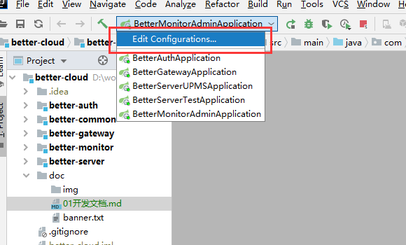

## 项目启动

### 环境

| 软件    | 版本     |
| ------- | -------- |
| `mysql` | 5.7      |
| `JDK`   | 1.8      |
| `nacos` | 1.1.4    |
| `redis` | 3.2+     |
| `IDEA`  | 2019.3.1 |

```
请使用提供的nacos软件
链接：https://pan.baidu.com/s/1uixdjNSVdKJVa0HSwYRDVQ 
提取码：d6g4
```

### 导入

1. IDEA导入`better-cloud/pom.xml`

2. 为`spring boot application`设置环境变量

   

   

   ```
   nacos.url=127.0.0.1;redis.url=127.0.0.1;better-monitor-admin=127.0.0.1;mysql.url=106.12.25.137;better-auth=127.0.0.1
   ```

   

3. 启动`redis` `nacos`

4. 启动微服务

### 账号密码

| 模块    | 账号    | 密码             |
| ------- | ------- | ---------------- |
| 认证    | better  | 1234qwer         |
| `Nacos` | `nacos` | `nacos`          |
| `mysql` | `root`  | `Liu@1213380440` |

### 使用Postman测试
启动项目后，导入doc/postman下的文件，进行接口测试
