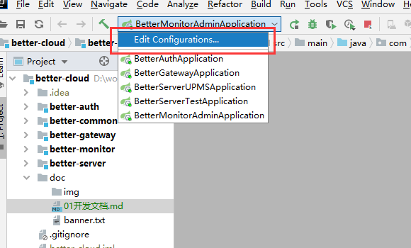
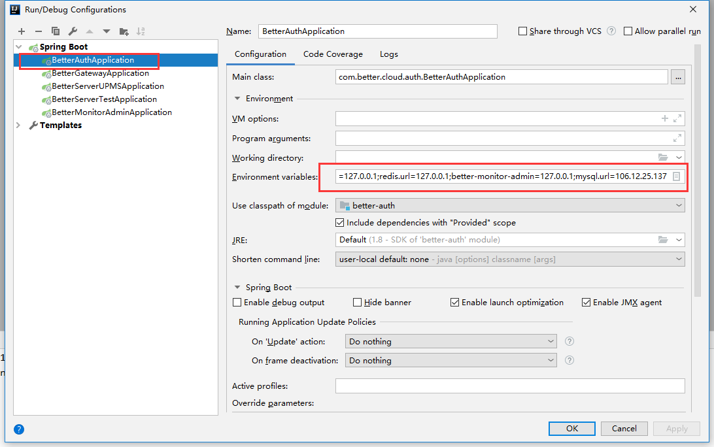

后端

```
https://gitee.com/treeshade/better-cloud.git
```

前端

```
https://gitee.com/treeshade/better-upms-web.git
```

***文档较为简略，如有遗漏与疑问，群里讨论***

## 项目启动

### 环境

| 软件    | 版本     |
| ------- | -------- |
| `mysql` | 5.7      |
| `JDK`   | 1.8      |
| `nacos` | 1.1.4    |
| `redis` | 3.2+     |
| `IDEA`  | 2019.3.1 |

```
可以使用提供的nacos
链接：https://pan.baidu.com/s/1uixdjNSVdKJVa0HSwYRDVQ 
提取码：d6g4
```

### 导入

1. IDEA导入`better-cloud/pom.xml`

2. 为每个 `spring boot application`设置环境变量

   

   

   ```
   mysql.url=106.12.25.137;nacos.url=127.0.0.1;redis.url=127.0.0.1;better-monitor-admin=127.0.0.1;better-auth=127.0.0.1;better-gateway=127.0.0.1
   ```

   

3. 启动`redis` `nacos`  
    `nacos`启动 Windows : ./bin/starup.cmd  
    访问`nacos`  `http://localhost:8001/nacos/`  
    账号密码:`nacos`  `nacos`
4. 启动微服务

### 账号密码

| 模块    | 账号    | 密码             |
| ------- | ------- | ---------------- |
| 认证    | better  | 1234qwer         |
| `Nacos` | `nacos` | `nacos`          |
| `mysql` | `root`  | `Liu@1213380440` |

### 使用Postman测试
启动项目后，导入doc/postman下的文件，进行接口测试


## 开发文档

### 目录结构

#### 后端

```
├─febs-cloud                      ------ 整个项目的父模块
	|-doc						  ------ 文档
    ├─better-auth                 ------ 微服务认证服务器                     
    ├─better-common               ------ 通用模块
    ├─better-gateway              ------ 微服务网关
    ├─better-monitor              ------ 微服务监控父模块
    │  ├─better-monitor-admin     ------ 微服务监控中心
    └─better-server               ------ 资源服务器
       ├─better-server-upms       ------ 资源服务器通用用户权限管理服务
       └─better-server-test       ------ 资源服务器demo，演示如何整合自己的微服务系统
       └─better-server-gen        ------ 代码生成服务 完善中
```

#### 前端

`vue-elemnt-admin`

[https://panjiachen.gitee.io/vue-element-admin-site/zh/guide/#%E5%8A%9F%E8%83%BD](https://panjiachen.gitee.io/vue-element-admin-site/zh/guide/#功能)

### 自定义注解介绍

注解位于`better-common`工程的`com.better.cloud.common.annotation`包下

1. `@EnableBetterAuthExceptionHandler`

   自定义认证异常处理

2. `@EnableBetterLettuceRedis`

   自定义`redis`序列化格式,防止`redis desktop Manager`出现不可读字符串

3. `@EnableBetterOauth2FeignClient`

   拦截feign调用，为请求添加认证用户和网关认证信息

4. `@EnableBetterServerProtect`

   拦截请求,防止外部请求直接调用微服务

5. `@BetterCloudApplication`

   整合:`@EnableBetterServerProtect` `@EnableBetterOauth2FeignClient` `@EnableBetterAuthExceptionHandler` 注解

### 搭建资源服务器

参考`better-server-test`

在`better-server`模块下新建资源服务器

## 前端
### 前端框架
- Vue
- element-ui
### 启动命令
```
npm install

npm run dev
```
### 开发启动条件
- 安装python(且需要在环境变量配置，在安装失败的情况下---本来会自己安装的)
- 安装sass(npm install node-sass),如果失败设置镜像为淘宝链接
```npm config set registry https://registry.npm.taobao.org```
### 注意
```js
如果安装失败，可能是使用的代理忘记开启（比如我自己）
```

